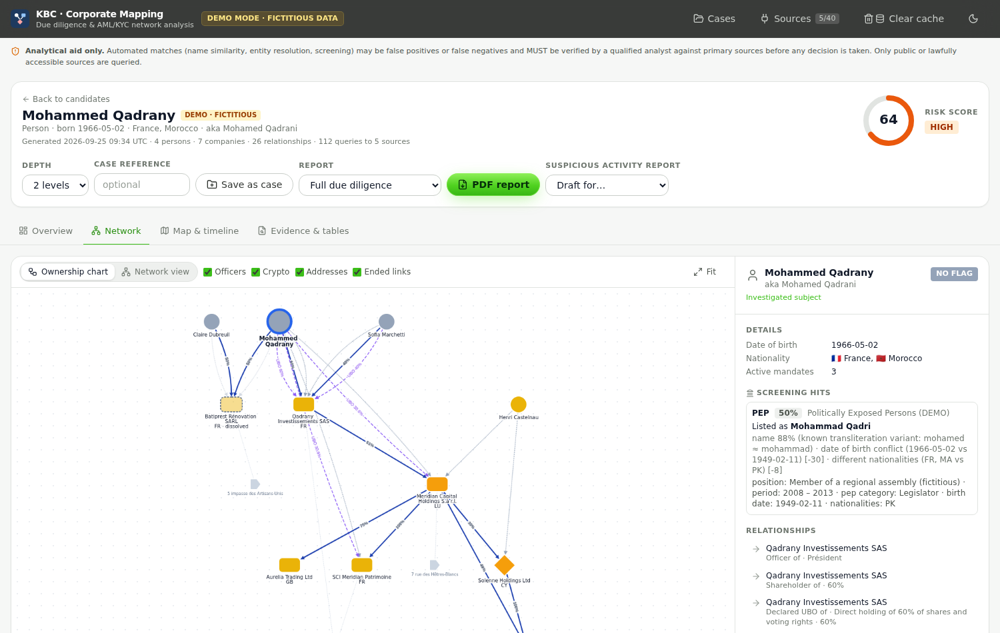
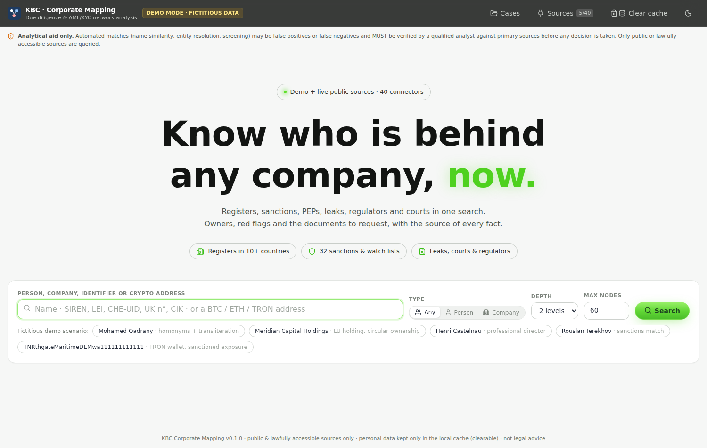
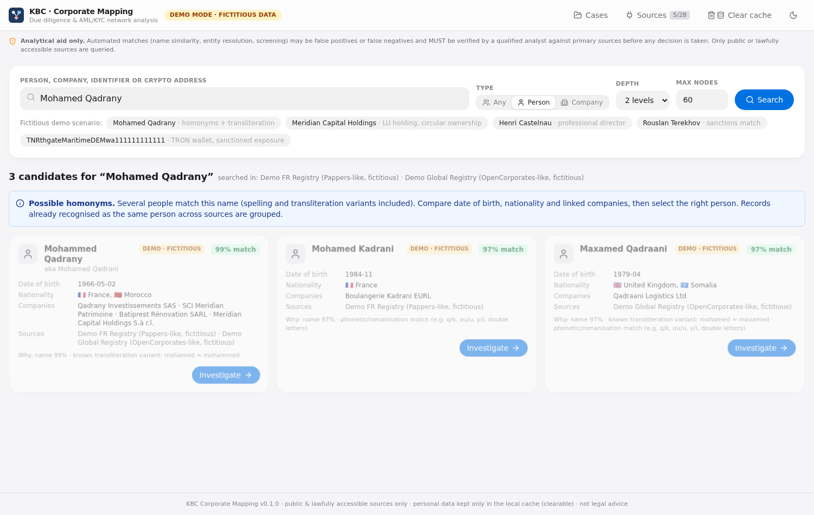
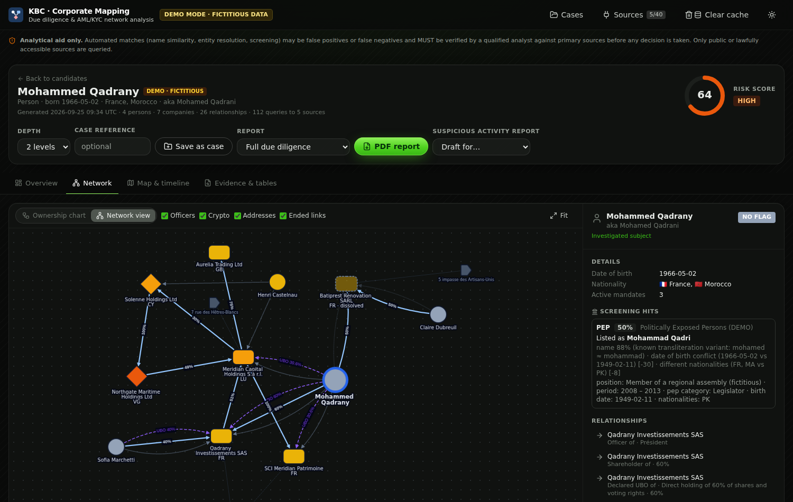
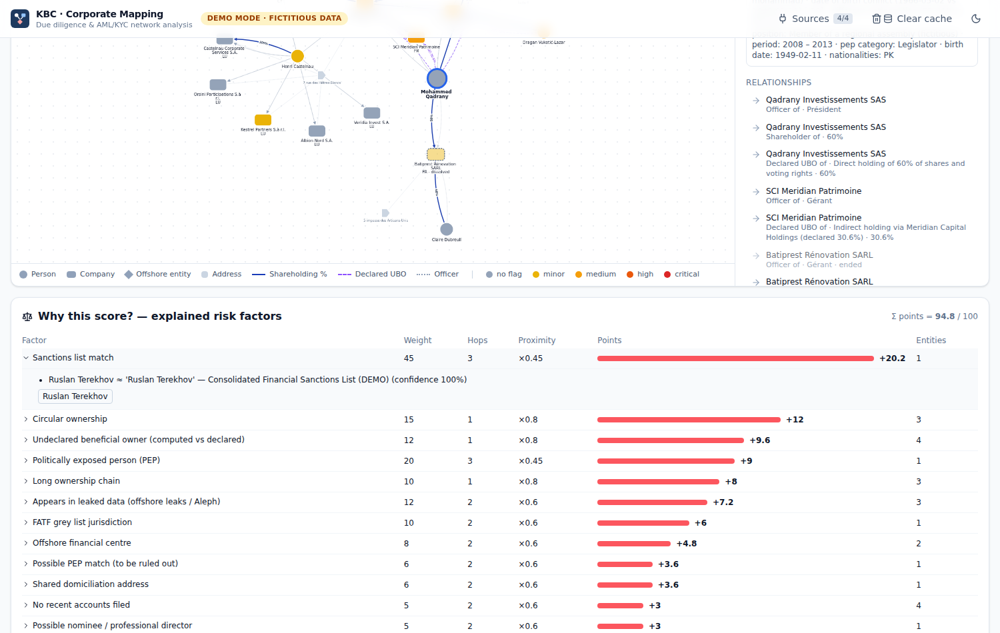
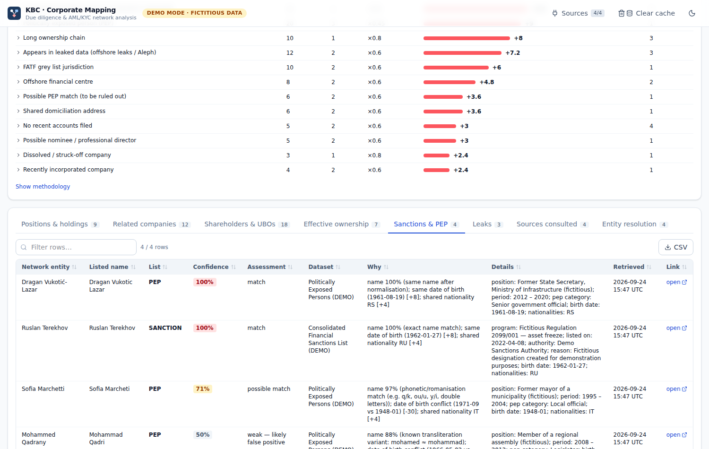
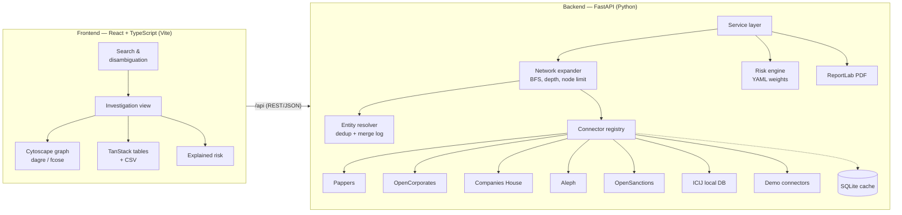

# KBC — Corporate Mapping for Due Diligence & AML/KYC

[](https://github.com/cryptocomiks/KBC/actions/workflows/ci.yml)


**Type the name of a person or a company. KBC searches public registries, sanctions/PEP lists and leak
databases, shows who owns and controls what, and explains every red flag. Each data point links back to
its source.**

> ⚠️ **Analytical aid only.** Automated matches can be false positives or false negatives. A qualified
> analyst must verify them against primary sources before taking any decision.



---

## Contents

1. [The business problem](#the-business-problem)
2. [What it does](#what-it-does)
3. [Screenshots](#screenshots)
4. [Run the demo in one command](#run-the-demo-in-one-command)
5. [Demo walkthrough (5 minutes)](#demo-walkthrough-5-minutes)
6. [Architecture](#architecture)
7. [How it works](#how-it-works)
8. [Configuration](#configuration)
9. [Data sources & connectors](#data-sources--connectors)
10. [Testing & quality](#testing--quality)
11. [Compliance & ethics](#compliance--ethics)
12. [Known limitations](#known-limitations)
13. [Roadmap](#roadmap)

---

## The business problem

Customer due diligence (CDD/EDD) and corporate intelligence work keep coming back to the same questions.
**Who is really behind this company? What else do these people control? Are any of them sanctioned,
politically exposed or named in a leak?** In Switzerland (AMLA / FINMA AMLO), Luxembourg (Law of
12 November 2004, CSSF) and across the EU (AMLD / AMLR), identifying the **ultimate beneficial owner
(UBO)** and documenting how you got there is a legal requirement, not a nice-to-have.

Answering these questions by hand is slow and error-prone:

- the data is spread over many registries, each with its own format, identifiers and name spellings;
- **homonyms and transliterations** (Mohamed / Mohammed / Maxamed) create false hits and hide true ones;
- ownership chains cross borders, with offshore holdings, **circular shareholdings** and nominee directors;
- a risk opinion with no audit trail is useless to a compliance officer, an auditor or a regulator.

KBC automates the collection and structuring work and leaves the judgement to the analyst. Every score is
explained, and every fact carries **its source, its URL and the time it was retrieved**.

## What it does

| Capability | Details |
|---|---|
| **Search & disambiguation** | Candidates are shown side by side with date of birth, nationality and linked companies, so the analyst picks the right person. Records already recognised as the same person across sources are grouped. |
| **Fuzzy matching** | Handles transliteration families, phonetic/romanisation rules, token order, accents, legal forms and missing middle names. Each match has a **confidence score and a plain-English explanation**. |
| **Network expansion** | Recursive breadth-first expansion with **adjustable depth (1–3)** and a **node limit** to prevent explosion. Frontier nodes are still queried to *close* edges, so a circular holding is not missed. |
| **Cross-source deduplication** | Companies are merged on registration number; persons on a close name **and** a compatible date of birth, never on the name alone. Every merge is logged with its evidence. |
| **Ownership analytics** | Direct and **computed effective ownership** (product of percentages along each path), UBO threshold (25%), cycle detection, corporate layer count. |
| **Red flags** | Sanctions, PEP, leaks, **undeclared UBOs (computed vs declared)**, FATF black/grey lists, EU tax blacklist, offshore centres, circular or long ownership chains, shared domiciliation addresses, recent / dissolved companies, missing accounts, possible nominee directors. |
| **Explained risk score** | `Σ (weight × proximity multiplier)`, capped at 100. Weights and thresholds live in an editable YAML file. No black box. |
| **Interactive graph** | Cytoscape.js with distinct shapes for persons / companies / offshore entities / addresses, ownership arrows labelled with percentages, colours by risk. Two views: a **hierarchical ownership chart** and a **free network view**. Click a node to open its details panel. |
| **Tables** | Positions, related companies, shareholders & UBOs, effective ownership, sanctions/PEP hits, leak appearances, sources consulted, entity-resolution log. All sortable and filterable, with **CSV export**. |
| **PDF report** | Due diligence report with summary, explained score, graph, all tables, sources with retrieval dates and methodology. Watermarked in demo mode. |
| **Linked documents** | For each company: dated legal notices and filings (BODACC, demo registries), plus direct links to the registers holding the documents themselves: INPI (deeds, articles, filed accounts), Companies House filing history, GLEIF record, BODACC, OpenCorporates. These appear in the details panel, a *Documents & filings* table and the PDF report. A published insolvency proceeding raises a red flag. |
| **Key findings** | A short, sourced reading of the network at the top of each investigation: identity, ultimate owners with the path (“held at 34 % by X via A → B”), main risk drivers, sanctions / PEP / leak hits, latest accounts, high-risk countries, coverage gaps. Every sentence links to its entities and sources. Also in the PDF. |
| **Timeline** | Every dated event of the network on one axis: incorporations and dissolutions, appointments and resignations, ownership changes, filings and legal notices, sanctions listings, press articles, first and last crypto transfers. Filterable by type. |
| **Country risk** | Each jurisdiction of the network with the **Basel AML Index**, the **Corruption Perceptions Index** and the **World Bank control-of-corruption** indicator, next to the FATF / EU / offshore lists. Refreshed monthly by a workflow (`config/country_risk.json`). |
| **Financials** | Revenue, net income and total assets by year (INPI accounts for France, SEC XBRL for US filers). A large balance sheet with no revenue raises a *shell-company indicator*. |
| **Traceability** | `Provenance {source, record_id, url, retrieved_at}` is attached to every entity, relationship and screening hit. |
| **Privacy** | Personal data is stored only in a local SQLite cache, which a **"Clear cache"** button wipes. |

## Screenshots

| Search | Disambiguation of homonyms |
|---|---|
|  |  |

| Network view (dark theme) | Explained risk score |
|---|---|
|  |  |

| Sortable, filterable tables with CSV export |
|---|
|  |

📄 A sample PDF report generated in demo mode: [`docs/sample_report_demo.pdf`](docs/sample_report_demo.pdf).

## Run the demo in one command

The demo mode runs **without any API key**. It uses a fully fictitious but realistic dataset (see
[the scenario](#the-demo-scenario)).

```bash
docker compose up --build
# → http://localhost:8080
```

<details>
<summary><b>Without Docker (local development)</b></summary>

Requirements: Python 3.11+, Node 20+.

```bash
make install        # venv + pip + npm ci
make dev-backend    # FastAPI on http://localhost:8000  (API docs: /api/docs)
make dev-frontend   # Vite on http://localhost:5173     (proxies /api to :8000)
```
</details>

<details>
<summary><b>Deploy on Vercel</b></summary>

The repository deploys to Vercel as is:

- the Vite frontend is built into `frontend/dist` and served statically;
- the FastAPI backend runs as a Python serverless function (`api/index.py`). `vercel.json` rewrites every
  `/api/*` request to it;
- PDF generation uses ReportLab (pure Python, fonts bundled), so no system library is needed;
- the SQLite cache lives in `/tmp` on Vercel. It is ephemeral, which is fine for a cache.

Import the repository in Vercel (no framework preset needed, `vercel.json` sets the commands), or:

```bash
npm i -g vercel && vercel deploy
```

`DEMO_MODE` and `LIVE_SOURCES` both default to `true`. The keyless real sources (data.gouv.fr, ICIJ)
work immediately. Add API keys as environment variables in the Vercel project settings to enable the
other sources. After each Vercel deployment, a GitHub Actions workflow (`smoke.yml`) exercises the live
site end to end, demo and real sources included.
</details>

## Demo walkthrough (5 minutes)

### The demo scenario

*All persons, companies, sanctions and leak entries are **fictitious**; `example.org` URLs are
placeholders.*

**Mohammed Qadrany**, a French businessman, controls a French holding (**Qadrany Investissements SAS**).
It owns 51% of a Luxembourg SOPARFI, **Meridian Capital Holdings S.à r.l.** The other 49% belongs to
**Northgate Maritime Holdings Ltd (BVI)**, which is 100% owned by **Solenne Holdings Ltd (Cyprus)**.
Solenne is itself 30% owned by Meridian (a **circular shareholding**) and 70% owned by
**Ruslan Terekhov**, who is on a (fictitious) sanctions list. Meridian also owns a UK trading company
**incorporated 10 months ago with no accounts filed**, co-owned with **Dragan Vukotić-Lazar**, a former
senior official (**PEP**). Meridian is **domiciled at an address shared by six companies**, all run by
the same **professional director**, who also appears in a (fictitious) court-filings collection. A
**dissolved** French company and a namesake who is a baker in Lyon complete the picture.

The data is split across **four fictitious sources**: a French registry (Pappers-like), a global registry
(OpenCorporates-like), a sanctions/PEP list (OpenSanctions-like) and a leaks archive (ICIJ/Aleph-like).
This demonstrates cross-source deduplication with real provenance.

### Suggested script

1. **Search "Mohamed Qadrany".** Three candidates come up: *Mohammed Qadrany*, *Mohamed Kadrani* and
   *Maxamed Qadraani*. The match explanations name the transliteration variant (`mohamed ≈ maxamed`) and
   the phonetic rules used. Compare dates of birth and companies, then pick the right person. Note that
   the FR and global registry records were already merged: *"aka Mohamed Qadrani"*.
2. **Ownership chart.** Show the chain Terekhov → Solenne (CY) → Northgate (BVI) → Meridian (LU) → UK /
   FR companies. Offshore entities are drawn as diamonds, arrows carry percentages, and the UBO
   declarations appear as dashed violet arrows.
3. **Switch the depth from 3 to 1**, then back. The score goes from **low** to **critical** because the
   sanctioned person sits three hops away. The node limit prevents the network from exploding.
4. **Why this score?** Open the "Sanctions list match" factor. It shows weight 45 × proximity 0.45
   (three hops) ≈ 20.2 points, with the evidence and the entities involved.
5. **Sanctions & PEP table.** Show the weak hit *Mohammad Qadri* (50%, date of birth conflict): it is
   displayed for review but **not scored**. That is how false positives are handled.
6. **Entity resolution tab and a node's sources.** Every fact has its source, record id, URL and
   retrieval time.
7. **Export the PDF report** (enter a case reference) and a CSV table.
8. **Search "Meridian Capital Holdings"** for the company-centric view. The *Effective ownership* tab
   shows that the sanctioned Ruslan Terekhov holds an **effective 34.3%**
   (70% × 100% × 49% through Cyprus and the BVI). Yet the only declared beneficial owner is
   Mohammed Qadrany. KBC raises this as an **undeclared UBO**, the kind of gap that the manual
   review of a beneficial-owner register rarely catches.

## Architecture



```
.
├── api/index.py               # Vercel serverless entry point (imports backend/app/main.py)
├── backend/
│   ├── app/
│   │   ├── connectors/        # BaseConnector interface, registry, demo connectors (+ real ones)
│   │   ├── matching/          # name normalisation, transliteration, fuzzy + explained matching
│   │   ├── graph/             # entity resolver, network expander, ownership analytics (networkx)
│   │   ├── risk/              # YAML config loader, explainable risk engine
│   │   ├── report/            # ReportLab PDF (+ bundled DejaVu fonts)
│   │   ├── demo/data/         # fictitious dataset (JSON)
│   │   ├── api/routes.py      # REST endpoints
│   │   ├── service.py         # search / investigation / tables
│   │   ├── models.py          # FollowTheMoney-inspired domain model with provenance
│   │   └── cache.py           # SQLite cache (clearable)
│   └── tests/                 # pytest suite
├── config/
│   ├── risk.yaml              # weights, thresholds, proximity multipliers, levels
│   └── jurisdictions.yaml     # FATF black/grey lists, EU tax blacklist, offshore centres
├── frontend/                  # React + TS + Tailwind + Cytoscape.js
├── docker-compose.yml  vercel.json  Makefile  .env.example
```

### REST API

| Method | Path | Purpose |
|---|---|---|
| `GET` | `/api/search?q=&type=any\|person\|company` | Disambiguation candidates with match score and explanation |
| `POST` | `/api/investigations` | `{record_ids, depth, max_nodes}` → graph, risk, tables, provenance |
| `POST` | `/api/reports/pdf` | Same parameters plus an optional graph PNG → PDF |
| `GET` | `/api/connectors` | Status of each source (enabled or disabled, with the reason) |
| `GET` | `/api/config/risk` | Active weights, thresholds and jurisdiction lists |
| `GET` / `DELETE` | `/api/cache` | Cache statistics / wipe |

Interactive OpenAPI documentation: `/api/docs`.

## How it works

### Data model and traceability

The model is loosely aligned with **FollowTheMoney**, the schema used by OCCRP Aleph and OpenSanctions.
It has three building blocks:

- `Entity`: `person`, `company` or `address`;
- `Relationship`: `officer`, `shareholder` (with %), `beneficial_owner` or `registered_at`;
- `ScreeningHit`: a match against a sanctions, PEP or leak dataset.

Every entity, relationship and screening hit carries a list of `Provenance(source, source_label,
record_id, url, retrieved_at)`. When two records merge, both provenances are kept.

### Name matching

A name is compared in three forms, and the best score wins:

1. **Normalised**: ASCII-folded, lower-cased, punctuation removed; honorifics and particles (`al`, `el`,
   `bin`…) dropped for persons, legal forms (`S.à r.l.`, `SAS`, `Ltd`…) dropped for companies; tokens
   sorted.
2. **Canonical**: each token is mapped to its **transliteration family** (e.g. `mohamed`, `mohammed`,
   `muhammad`, `maxamed` → `muhammad`). The families are editable in `matching/names.py`.
3. **Phonetic skeleton**: systematic romanisation rules (`q→k`, `kh→h`, `ou→u`, `y→i`, double letters…).

Tokens are **aligned one by one**, blending the mean and the minimum score, so a shared first name cannot
hide a different surname. At entity level, the date of birth (exact +8, partial +4, conflict −30),
nationality and jurisdiction adjust the score. The explanation lists each adjustment.

### Network expansion

Breadth-first search from the subject. Nodes at depth `< max_depth` add their neighbours. Nodes at the
frontier are still queried, but only to connect entities already in the network. Every new entity is
**cross-referenced** in the other registries that cover its jurisdiction, and merged when the evidence is
strong. Every connector call is logged; the log becomes the "Sources consulted" table.

### Risk scoring

```
score = min(100, Σ_factors  weight(factor) × proximity(distance of the closest affected entity))
```

Each factor counts **once**, so volume cannot inflate the score. Proximity multipliers by distance to the
subject: ×1.0 at 0 hops, ×0.8 at 1, ×0.6 at 2, ×0.45 at 3. Levels: low < 20 ≤ medium < 45 ≤ high < 70 ≤
critical.

| Factor | Default weight |
|---|---|
| Sanctions match (≥ 85%) / possible match (70–85%) | 45 / 15 |
| PEP match / possible match | 20 / 6 |
| FATF black list / grey list jurisdiction | 30 / 10 |
| Circular ownership | 15 |
| Appearance in leaks | 12 |
| **Undeclared UBO**: computed effective interest ≥ 25% but absent from the declared beneficial owners | 12 |
| Long ownership chain (≥ 3 corporate layers) | 10 |
| EU tax blacklist | 10 |
| Offshore financial centre | 8 |
| Shared domiciliation address (≥ 3 companies) | 6 |
| Missing / overdue accounts, possible nominee director | 5 |
| Recent incorporation (< 18 months) | 4 |
| Dissolved company | 3 |

Screening hits below 70% are displayed as *"weak — likely false positive"* and never scored.

## Configuration

| File | Purpose |
|---|---|
| `.env` (copy `.env.example`) | `DEMO_MODE`, API keys, cache path/TTL. `LIVE_SOURCES`. A missing key simply disables its connector, with a clear message in the UI (*"Disabled: PAPPERS_API_KEY is not set"*). Empty values are treated as unset. |
| `config/risk.yaml` | Factor weights, match thresholds, proximity multipliers, level boundaries. |
| `config/jurisdictions.yaml` | FATF black and grey lists, EU tax blacklist and offshore centres (ISO-2). **Review them against the latest FATF/EU publications before real use.** The file shows its `as_of` date. |

## Data sources & connectors

Every source implements the same `BaseConnector` interface:
`search_person`, `search_company`, `get_company_details`, `get_officers`, `get_shareholders`, plus
optional `get_person_roles`, `get_subsidiaries`, `search_address` and `screen`. Adding a source such as
**LBR/RBE (LU)** means writing one class and registering it in `connectors/registry.py`.

**Hybrid mode.** The fictitious demo scenario and the real sources are searchable side by side, but an
investigation never mixes them. An investigation started on a demo entity queries only the demo
connectors, and vice versa. Entities from the two realms are never merged, and every candidate carries
a *Demo · fictitious* or *Real public data* badge.

| Source | Coverage | Key | Env variable |
|---|---|---|---|
| **Annuaire des Entreprises** (data.gouv.fr) | FR companies, officers with partial date of birth, status, published financial years | none, public API | — |
| **GLEIF** (LEI index) | Legal entities worldwide, registration numbers, **direct parents and subsidiaries** (accounting consolidation) | none, public API | — |
| **Zefix** (Swiss commercial register) | CH companies: UID, seat, legal form, purpose, address, auditor, mergers, former names. **Officers with appointment and departure dates**, read from the Swiss Official Gazette of Commerce (SOGC) notices; partners of GmbH / Sàrl as owners. SOGC notices as linked documents (bankruptcy raises the insolvency flag) | none, public service | — |
| **SEC EDGAR** | US filers: profile, former names, state of incorporation, **financials from XBRL** (revenue, net income, assets), **shareholders above 5 % from Schedule 13D/13G with the exact percentage**, recent 10-K / 10-Q / 8-K filings | none (a contact in the User-Agent) | `SEC_USER_AGENT` |
| **Country risk** | Basel AML Index (Basel Institute on Governance), Corruption Perceptions Index (Transparency International, via Our World in Data), World Bank WGI control of corruption | none, refreshed monthly by the *Country risk data* workflow | — |
| **BODACC** (DILA) | French legal announcements: registrations, changes, **filed accounts**, **insolvency proceedings**, deregistrations. Each notice is a linked document | none, open data | — |
| **Official sanctions lists** | **OFAC SDN** (US Treasury) and **UN Security Council** consolidated list, downloaded from the issuers and indexed in memory | none | — |
| **Open watchlists** | **EU**, **UK (HMT/OFSI)** and **Swiss (SECO)** sanctions, **World Bank** debarments, **Interpol** public red notices, from the normalised OpenSanctions bulk exports (CC BY-NC) | none | `OPEN_DATASETS` |
| **Wikidata** | PEP screening (positions held, with dates), **relatives and close associates**, company ↔ executive / owner / subsidiary links, **official website, published company contacts and official social accounts** | none | — |
| **GDELT** | Adverse media: recent worldwide news mentioning the subject with financial-crime keywords (leads to review) | none | — |
| **Blockchain explorers** | Wallet search (BTC, ETH, TRON), aggregated on-chain flows, OFAC-listed crypto addresses linked to their owner | none | — |
| **ICIJ Offshore Leaks** | Panama, Paradise, Pandora Papers, Bahamas Leaks, Offshore Leaks. One batched query per investigation, so each hit is attributed to its leak | none, public API | — |
| ICIJ Offshore Leaks, local copy | Full bulk dataset, offline (`python scripts/import_icij.py`) | none | `ICIJ_DB_PATH` |
| **Pappers** | FR declared beneficial owners (%), officers, filed accounts | [pappers.fr/api](https://www.pappers.fr/api) (credits) | `PAPPERS_API_KEY` |
| **Companies House** | UK companies, officers and all their appointments, persons with significant control | [free key](https://developer.company-information.service.gov.uk) | `COMPANIES_HOUSE_API_KEY` |
| **OpenCorporates** | 140+ company registries worldwide | [api.opencorporates.com](https://api.opencorporates.com) | `OPENCORPORATES_API_TOKEN` |
| **OpenSanctions** | Consolidated sanctions lists, PEPs, watchlists (batched `/match`) | [opensanctions.org/api](https://www.opensanctions.org/api/) | `OPENSANCTIONS_API_KEY` |
| **OCCRP Aleph** | Leaks, registries, court records, gazettes | [free account](https://aleph.occrp.org) | `ALEPH_API_KEY` |
| Demo connectors (4) | Fictitious registries, sanctions/PEP, leaks | none | `DEMO_MODE` |

On Vercel, add the keys under *Project → Settings → Environment Variables*, then redeploy. The
"Sources" menu shows the status of each connector.

**Licences and fair use.**

- ICIJ Offshore Leaks data is under the ODbL (attribution: International Consortium of Investigative
  Journalists). Appearing in it does not imply wrongdoing.
- OpenSanctions data is CC BY-NC 4.0: commercial use requires a licence.
- Respect each provider's terms and rate limits. Answers are cached for 72 h by default.

## Testing & quality

```bash
make test   # pytest: matching, resolution, ownership, expansion, risk scoring, API, PDF
make lint   # ruff check + ruff format --check + TypeScript typecheck
```

CI (GitHub Actions) runs the backend lint and tests and the frontend build on every push. The real
connectors are tested against **mocked HTTP responses** shaped like each API's documentation (`respx`), so
the unit tests never call external APIs. The live behaviour is checked after each deployment by
`scripts/smoke_test.py --live`.

## Compliance & ethics

- **Public or lawfully accessible sources only.** No scraping behind logins, no paid data resold.
- **Human in the loop.** A permanent disclaimer in the UI and in the PDF. Weak matches are shown but not
  scored. The analyst chooses among the homonyms.
- **No profiling of private individuals.** Contacts and social accounts are shown only for companies
  and public figures (people notable enough to have a Wikidata item), and only when officially
  published. A person's e-mail address or phone number is never displayed, even when published.
- **Data minimisation (GDPR / Swiss nFADP).** No database of persons: personal data lives only in the
  SQLite cache (72 h TTL by default), which **"Clear cache"** wipes along with every computed
  investigation. No person address nodes are created, only company registered offices.
- **Explainability.** Every score can be broken down into factors, weights, distances and evidence.
- **Demo data is fictitious** and watermarked as such in the PDF.

## Known limitations

- **Name matching is heuristic.** The transliteration families cover common Arabic, Somali, Russian and
  Ukrainian variants, not every script or language. Non-Latin scripts rely on the aliases provided by
  the sources.
- **Effective ownership** multiplies percentages along simple paths. Circular paths are cut (a
  conservative approximation), and voting rights, options or trusts are not modelled.
- **Jurisdiction lists** are a snapshot and must be kept up to date.
- **On Vercel**, the cache is ephemeral and functions have a time limit. Deep expansions over live APIs
  are better run with Docker. The ICIJ dataset (several hundred MB) is meant for local or Docker use.
- **Address matching** uses normalised token similarity. It can miss heavily reformatted addresses.
- **Zefix officers** are parsed from the text of the SOGC notices (German, French, Italian). Unusual
  wordings can be missed; the notices themselves are always linked. Only publications available in
  Zefix are read.
- **SEC 13D/13G percentages** are read from the structured filings (since December 2024). Older
  ownership filings are linked as documents without a percentage.
- **Beneficial ownership registers**: the UK PSC register is available through Companies House (free
  key). Most EU registers restrict access since the 2022 CJEU ruling.
- **Registry coverage** varies: some jurisdictions (BVI, for example) publish no officers or accounts.
  The absence of data is itself reported, not interpreted as "clean".

## Roadmap

- LBR/RBE (Luxembourg): no free API; the RBE is restricted to professionals since the 2022 CJEU ruling, so the tool links to the register instead
- Analyst workflow: mark a hit as confirmed or false positive, with the decision recorded in the report
- Adverse media screening

## License

MIT, see [LICENSE](LICENSE). The DejaVu fonts bundled for PDF rendering are under their own free licence
(`backend/app/report/fonts/LICENSE-DejaVu.txt`).

*This software does not constitute legal advice and does not replace the judgement of a qualified
compliance professional.*
